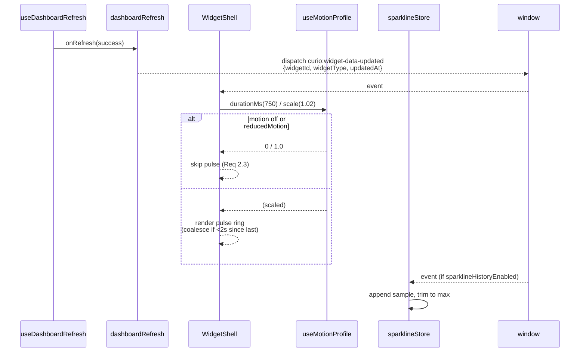
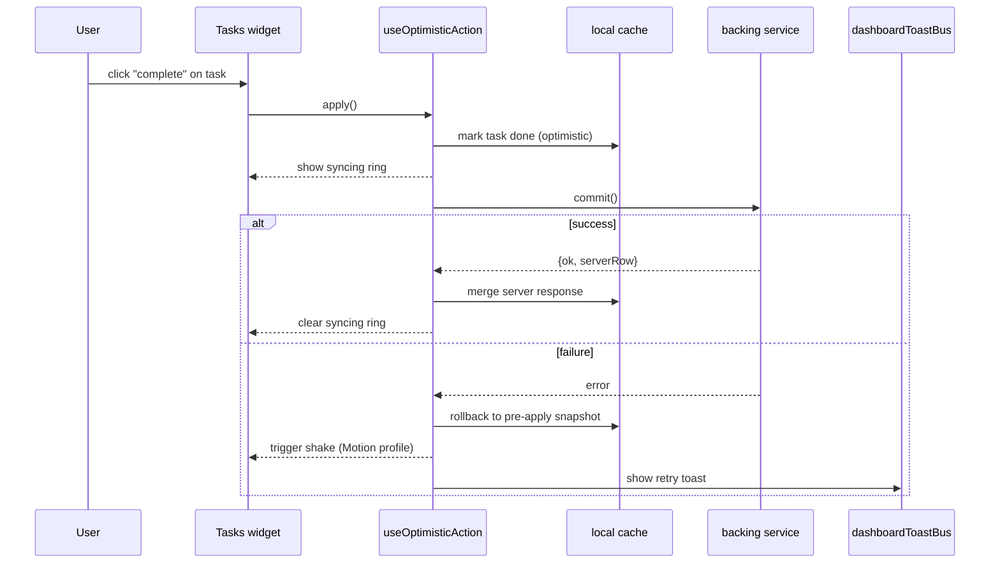
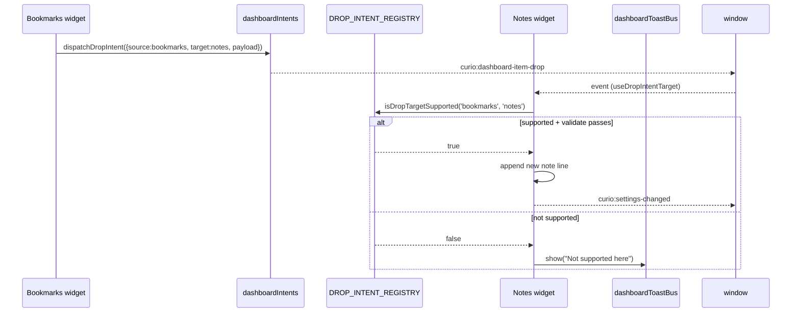
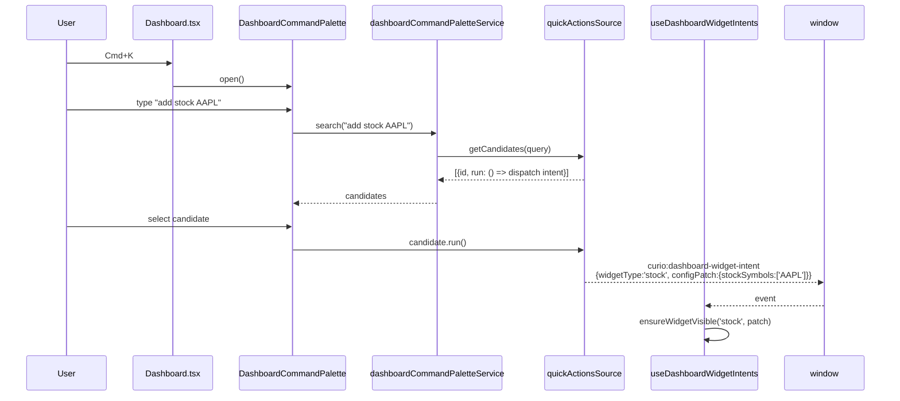
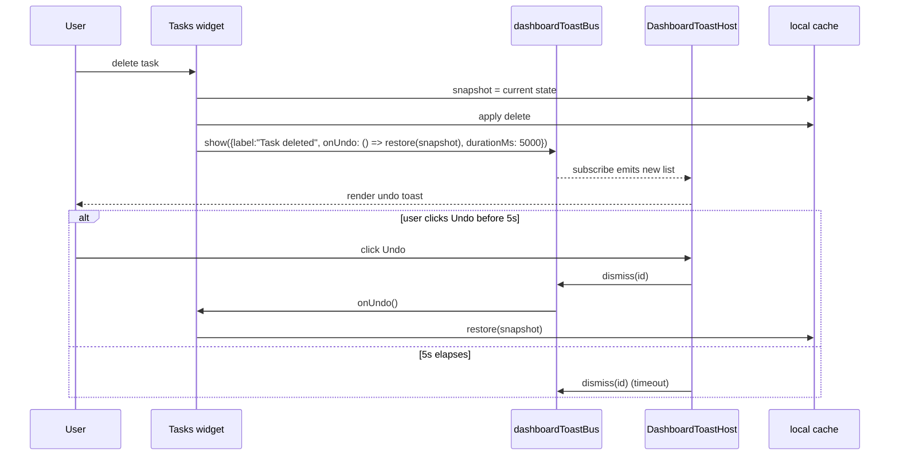

# Design Document — Dashboard Interactivity Upgrades

## Overview

This feature adds a unified set of dashboard-wide interactivity primitives,
cross-widget dataflow, and live-status expressiveness on top of the existing
Curio Robot dashboard. It turns 60+ static widgets into a connected,
directly manipulable surface while keeping every new behavior individually
toggleable, Home Assistant ingress compatible, and respectful of reduced
motion.

The design is organized around five pillars:

1. **Shared primitives** in `widgetPrimitives/` (`WidgetCounter`,
   `WidgetSkeleton`, `WidgetInlineError`, `WidgetIconButton`,
   `InlineQuickAdd`) so widgets describe intent and the primitives
   enforce consistency.
2. **Shared hooks** in `src/hooks/` (`useRelativeTime`,
   `useWidgetPersistentState`, `useOptimisticAction`,
   `useDashboardToastBus`, `useDashboardCommandPalette`,
   `useSwipeGesture`, `useDragReorder`, `useLongPressEdit`,
   `useListKeyboardNav`, `useMotionProfile`) so any widget plugs in
   without duplicating logic.
3. **Shared services** in `src/services/` (`dashboardToastBus`,
   `dashboardCommandPaletteService`, `dashboardLayoutPresets`,
   `dashboardSparklineStore`, `dashboardIntents`) so state, search
   sources, and event contracts live outside component trees.
4. **Settings + data model** updates to `DashboardBoardPreferences`,
   `DashboardWidgetConfig`, `dashboardSettings.ts`, and
   `settingsMigrations.ts` to expose an explicit `InteractivitySettings`
   block with per-widget overrides, a new settings migration, and
   backup/restore coverage through `curioBackupService.ts`.
5. **Event bus contracts**: a small, documented set of CustomEvents
   (`curio:widget-data-updated`, `curio:dashboard-item-drop`,
   `curio:dashboard-hover`, `curio:dashboard-select`,
   `curio:dashboard-scroll-to-widget`, `curio:dashboard-toast`) with
   defined payloads, coalescing rules, and dispatcher/listener pairs.

The existing `WidgetShell`, `DashboardFocusedWidgetOverlay`,
`dashboardRefresh`, and `useDashboardWidgetIntents` infrastructure is
extended rather than replaced. No new required backend services are
introduced. All persisted keys follow the `curio_*` prefix so the
existing backup sweep in `curioBackupService.ts` picks them up.

---

## Architecture

```mermaid
flowchart TB
  subgraph Settings[Settings & Persistence]
    DS[dashboardSettings.ts<br/>InteractivitySettings]
    MIG[settingsMigrations.ts<br/>v2 Interactivity defaults]
    BACKUP[curioBackupService.ts<br/>curio_* prefix sweep]
  end

  subgraph Services[Dashboard Services]
    TOAST[dashboardToastBus.ts]
    PALETTE[dashboardCommandPaletteService.ts]
    PRESETS[dashboardLayoutPresets.ts]
    SPARK[dashboardSparklineStore.ts]
    INTENTS[dashboardIntents.ts]
    REFRESH[dashboardRefresh.ts<br/>+curio:widget-data-updated]
  end

  subgraph Hooks[Shared Hooks]
    URT[useRelativeTime]
    UPS[useWidgetPersistentState]
    UOA[useOptimisticAction]
    UDT[useDashboardToastBus]
    UCP[useDashboardCommandPalette]
    USG[useSwipeGesture]
    UDR[useDragReorder]
    ULE[useLongPressEdit]
    ULK[useListKeyboardNav]
    UMP[useMotionProfile]
  end

  subgraph Primitives[widgetPrimitives/]
    WC[WidgetCounter]
    WS[WidgetSkeleton]
    WIE[WidgetInlineError]
    WIB[WidgetIconButton]
    IQA[InlineQuickAdd]
  end

  subgraph Dashboard[Dashboard Shell]
    DASH[Dashboard.tsx<br/>MotionConfig boundary]
    SHELL[WidgetShell<br/>FreshnessDot + pulse + sheen + aria-live]
    FOCUS[DashboardFocusedWidgetOverlay<br/>focused=true editors]
    CMD[DashboardCommandPalette.tsx]
    TOASTHOST[DashboardToastHost.tsx]
  end

  subgraph Widgets[60+ Widgets]
    LISTS[Tasks / Reminders / Chores /<br/>Bookmarks / Stocks / Portfolio / ...]
    SPECIAL[Pomodoro / WorldClock /<br/>NowPlaying / ImageGallery / ...]
  end

  DS --> DASH
  MIG --> DS
  BACKUP --> DS
  BACKUP --> SPARK
  BACKUP --> PRESETS

  REFRESH -->|curio:widget-data-updated| SHELL
  SHELL --> WC
  SHELL --> WS
  SHELL --> WIE
  SHELL --> UMP

  TOAST --> TOASTHOST
  PALETTE --> CMD
  INTENTS --> DASH

  Hooks --> Widgets
  Primitives --> Widgets
  Widgets --> INTENTS
  Widgets --> TOAST
  Widgets --> SPARK
  Widgets --> UOA
```



### Layered responsibilities

- **Dashboard.tsx** owns the `MotionConfig` boundary, mounts
  `DashboardToastHost`, registers the `⌘K/Ctrl+K` listener for the
  command palette, and continues to own the focused-widget overlay.
- **WidgetShell** owns ambient pulse, `FreshnessDot`, stale-revalidate
  sheen, the `aria-live` announcement region, and the existing
  accent/glow/glass system. It reads from `useMotionProfile()` to scale
  every animation.
- **Widgets** stay thin. They compose primitives, call shared hooks,
  and dispatch domain events. Business logic (sparkline bookkeeping,
  toast queues, palette sources, preset serialization) lives in
  services.
- **Services** own all persistence, event-bus contracts, and pure
  reducers. This is where the property-based tests hit.

### Lazy-loading boundaries

- `DashboardCommandPalette.tsx` is lazy-loaded and only mounted after
  the first `⌘K` / `Ctrl+K` press. The keyboard listener is a cheap
  top-level `useEffect` on `Dashboard.tsx`.
- Palette **sources** register lazily through
  `dashboardCommandPaletteService.registerSource(...)`. Widget-level
  sources register on mount and unregister on unmount, so a board with
  few widgets does not pay for catalog-wide indexing.
- The focused-overlay editors (Stocks multi-timeframe chart, Calendar
  week/month, Mail thread reader, Habits heatmap, Tasks subtasks,
  Portfolio lot editor, Weather radar) live inside the existing widget
  components behind a `focused === true` branch so no code duplicates
  compact mode; heavy subtrees are imported via `React.lazy` inside the
  widget to keep the compact bundle small.
- `dashboardLayoutPresets.ts`, `dashboardSparklineStore.ts`, and
  `dashboardIntents.ts` are plain modules with no React surface; they
  are tree-shaken for pages that do not use them.

---

## Components and Interfaces

### 1. Shared primitives (`src/components/curio/dashboard/widgetPrimitives/`)

#### `WidgetCounter` (Requirement 1, 29.4)

```ts
export type WidgetCounterMode = 'odometer' | 'slotRoll' | 'tickUp';

export interface WidgetCounterProps {
  value: number;
  mode?: WidgetCounterMode;            // default 'tickUp'
  precision?: number;                  // default 0
  durationMs?: number;                 // default 650
  format?: (n: number) => string;      // default toLocaleString
  prefersReducedMotion?: boolean;      // escape hatch
  className?: string;
  ariaLabel?: string;                  // for aria-live region
}
```

Internal behavior:

- Uses Framer Motion's `useMotionValue` + `useTransform` + `animate`
  (already a repo dependency).
- Uses `useMotionProfile()` (see below). If `mode === 'off'` or
  `prefersReducedMotion`, it sets `motionValue.set(value)` without an
  animation.
- For `odometer`, renders per-digit columns sliding vertically.
- For `slotRoll`, renders the entire number rolling up/down a single
  column.
- For `tickUp`, interpolates the numeric value and formats on each
  frame.
- Guards against non-finite inputs by short-circuiting to a static
  fallback (`"—"` by default).
- Always settles `motionValue.set(value)` on animation end to guarantee
  the final rendered text equals `format(value)` exactly (Requirement
  1.10).

Consumers: Stocks, Portfolio, Activity (Health), Habits, AirQuality,
Tasks counts, Insights counts.

#### `WidgetSkeleton` (Requirement 18)

```ts
export interface WidgetSkeletonProps {
  variant?: 'stat' | 'list' | 'chart' | 'grid' | 'hero' | 'custom';
  rows?: number;       // list/grid
  children?: React.ReactNode; // custom layouts
  className?: string;
}
```

Renders neutral placeholder blocks using the existing
`bg-[var(--ether-control-bg)]` token. `useMotionProfile()` decides
whether to shimmer. Outer dimensions use `w-full h-full` so bounding
box always equals `WidgetBody`.

#### `WidgetInlineError` (Requirement 21)

```ts
export interface WidgetInlineErrorProps {
  message: string;
  onRetry?: () => void;
  onOpenSettings?: () => void;
  compact?: boolean;
}
```

Rendered inside `WidgetBody`. Retry dispatches the widget's refresh
event (using `getDashboardRefreshEventName(widgetId)`). "Open Settings"
calls `onOpenWidgetSettings(widgetId)` from the existing props flow.

#### `WidgetIconButton` (Requirement 27)

```ts
export interface WidgetIconButtonProps
  extends Omit<React.ButtonHTMLAttributes<HTMLButtonElement>, 'children'> {
  icon: React.ReactNode;
  ariaLabel: string;           // required in dev
  tone?: 'default' | 'danger' | 'primary';
  compact?: boolean;           // opt-in 36px min when body < 200px
}
```

Enforces `min-w-[44px] min-h-[44px]` and the standard focus ring. Uses
a container query (`@container (width < 200px)`) so small widget sizes
relax to 36px without a JS measurement round-trip. Dev-mode warns when
`ariaLabel` is empty.

#### `InlineQuickAdd` (Requirement 7)

```ts
export interface InlineQuickAddProps<T> {
  placeholder: string;
  parser: (input: string) => T | ParseError;
  onSubmit: (parsed: T) => void;
  onDismiss?: () => void;
  showShortcutHint?: boolean;
  ariaLabel?: string;
  compact?: boolean;
}
```

Parsers live in their own files for testability:

- `src/services/quickAddParsers/taskParser.ts`
- `src/services/quickAddParsers/timerParser.ts`
- `src/services/quickAddParsers/stockSymbolParser.ts`
- `src/services/quickAddParsers/reminderParser.ts`

Timer parser exposes a paired `format(ms): string` so the round-trip
property holds. Task/reminder parsers use a small deterministic
chrono-like layer (no new dependency): regex for relative phrases
("in 30m", "tomorrow 9am") that returns `{ title, dueAt }` or
`{ parseError }`. Keeping parsing pure makes it easy to test.

### 2. WidgetShell extensions (Requirements 2, 20, 22, 26)

`WidgetShell` gains four new visual layers inside the existing
`isolate` stack:

1. **Ambient pulse ring** — renders when `curio:widget-data-updated`
   fires for its widgetId. Uses `useMotionProfile()` to pick opacity +
   scale; coalesces multiple fires within 2 seconds into a single
   pulse via a ref-held timestamp (Requirement 2.7).
2. **FreshnessDot** — placed in the existing refresh-metadata chip.
   Derives state from `(updatedAt, intervalMs, lastRefreshError)` via
   `computeFreshnessState()` (pure function in
   `dashboardRefresh.ts`). Retry chip dispatches the existing refresh
   event.
3. **Stale-while-revalidate sheen** — absolutely-positioned top-edge
   gradient controlled by a `refreshInFlight` signal from
   `useDashboardRefresh`. Suppressed while `isFirstLoad`.
4. **aria-live region** — an `sr-only` div updated by a coalescing
   hook (`useWidgetAriaAnnouncer(widgetId, text)`) so screen readers
   hear at most one announcement per 2 seconds per widget.

`WidgetShell` accepts three new optional props that default to reading
from context/hooks so existing widgets need zero changes:

```ts
interface WidgetShellProps {
  // ... existing
  freshness?: 'fresh' | 'idle' | 'stale' | 'error';
  refreshInFlight?: boolean;
  ariaAnnouncement?: string;
}
```

### 3. `DashboardCommandPalette.tsx` (Requirement 23)

- Modal portal rendered into `document.body` with focus trap.
- Opened by a `⌘K` / `Ctrl+K` listener in `Dashboard.tsx`, suppressed
  while `document.activeElement` matches text-editable selectors
  (`input`, `textarea`, `[contenteditable="true"]`).
- Pulls candidates from `dashboardCommandPaletteService.search(query)`.
- On select: dispatches one of
  - `curio:dashboard-scroll-to-widget` (on-board widgets),
  - `curio:dashboard-widget-intent` (catalog add — reuses
    `useDashboardWidgetIntents`),
  - quick-action handlers (timer add, stock add, HA service call)
    routed through the existing `toolCallRouter` where appropriate,
  - `curio:card-open` or the matching existing card-open event (recent
    cards).
- Restores previous focus on close.

### 4. `DashboardToastHost.tsx` (Requirement 16)

- Mounted inside `Dashboard.tsx` (outside the grid so it survives
  page switches).
- Subscribes to `dashboardToastBus`. Renders up to three stacked
  toasts; destructive toasts include an Undo button.
- Toasts have a single stable internal id so repeated `show()` calls
  with the same id replace rather than duplicate.

### 5. `DashboardWidgetActionMenu.tsx` (extensions)

- Gains "Pin preset", "Save as preset", "Export preset",
  "Import preset" entries when the user has permission to edit the
  active page.
- Gains "Copy widget link" (`curio:dashboard-scroll-to-widget` target)
  for cross-widget palette use.

### 6. `DashboardSection.tsx` settings (Requirement 30)

New "Interactivity" sub-section rendering:

- Animation Intensity segmented control (`off`, `subtle`, `full`).
- One `ToggleRow` per `InteractivitySetting` key.
- Help copy referencing `docs/dashboard.md`.

---

## Data Models

### Additions to `src/services/dashboardTypes.ts`

```ts
export type DashboardAnimationIntensity = 'off' | 'subtle' | 'full';

export interface DashboardInteractivitySettings {
  animationIntensity: DashboardAnimationIntensity;

  // Ambient / status
  ambientPulseEnabled: boolean;
  freshnessDotEnabled: boolean;
  staleRevalidateSheenEnabled: boolean;

  // Direct manipulation
  swipeGesturesEnabled: boolean;
  longPressEditEnabled: boolean;
  doubleClickEditEnabled: boolean;
  dragReorderEnabled: boolean;

  // Discovery
  commandPaletteEnabled: boolean;

  // Cross-widget dataflow
  dropIntentsEnabled: boolean;
  hoverSelectionBusEnabled: boolean;

  // State + UX
  undoToastsEnabled: boolean;
  widgetPinningEnabled: boolean;
  relativeTimeHintsEnabled: boolean;
  rollingNumbersEnabled: boolean;
  inlineQuickAddEnabled: boolean;
  optimisticActionsEnabled: boolean;
  insightsActionsEnabled: boolean;
  ariaLiveUpdatesEnabled: boolean;
  sparklineHistoryEnabled: boolean;
}

export const DEFAULT_DASHBOARD_INTERACTIVITY_SETTINGS: DashboardInteractivitySettings = {
  animationIntensity: 'full',
  ambientPulseEnabled: true,
  freshnessDotEnabled: true,
  staleRevalidateSheenEnabled: true,
  swipeGesturesEnabled: true,       // runtime refines to false on fine-pointer (Req 6.5)
  longPressEditEnabled: true,
  doubleClickEditEnabled: true,
  dragReorderEnabled: true,
  commandPaletteEnabled: true,
  dropIntentsEnabled: true,
  hoverSelectionBusEnabled: true,
  undoToastsEnabled: true,
  widgetPinningEnabled: true,
  relativeTimeHintsEnabled: true,
  rollingNumbersEnabled: true,
  inlineQuickAddEnabled: true,
  optimisticActionsEnabled: true,
  insightsActionsEnabled: true,
  ariaLiveUpdatesEnabled: true,
  sparklineHistoryEnabled: true,
};
```

### `DashboardBoardPreferences` diff

Add a single nested block (keeps existing top-level keys stable, lets
backup/restore just copy the whole preferences object):

```ts
export interface DashboardBoardPreferences {
  // ... existing fields unchanged
  interactivity: DashboardInteractivitySettings;
}
```

Update `DEFAULT_DASHBOARD_PREFERENCES` to include
`interactivity: DEFAULT_DASHBOARD_INTERACTIVITY_SETTINGS`.
`normalizeDashboardPreferences` in `dashboardSettings.ts` fills any
missing keys with defaults so pre-migration storage still boots.

### `DashboardWidgetConfig` diff

New optional fields, all `undefined` by default. Presence (not value)
determines whether the per-widget override wins (Requirement 30.6).

```ts
export interface DashboardWidgetConfig {
  // ... existing

  // Cross-widget dataflow
  linkedTaskId?: string;
  linkedCommuteId?: string;
  linkedMusicWidgetId?: string;
  linkedWidgetIds?: string[];

  // Pinning (per-widget, stored alongside config so it round-trips
  // through existing page persistence)
  pinnedItemIds?: string[];

  // Per-widget overrides for board-level interactivity settings
  ambientPulseEnabled?: boolean;
  freshnessDotEnabled?: boolean;
  swipeGesturesEnabled?: boolean;
  dragReorderEnabled?: boolean;
  rollingNumbersEnabled?: boolean;
  widgetPinningEnabled?: boolean;

  // Widget-specific wins (Requirement 29)
  seekBarLiveSyncEnabled?: boolean;     // NowPlaying
  breathingRingEnabled?: boolean;       // Pomodoro
  valueMorphEnabled?: boolean;          // AirQuality, Stocks, etc.
  clockOffsetPreviewEnabled?: boolean;  // WorldClock
  pinchZoomEnabled?: boolean;           // ImageGallery
  ttsWordHighlightEnabled?: boolean;    // RichNote

  // Sparkline config
  sparklineMaxSamples?: number;         // defaults to 60
}
```

### New stores

#### `src/services/dashboardSparklineStore.ts`

localStorage-backed bounded ring buffer.

```ts
export interface SparklineSample { t: number; v: number; }

const key = (widgetId: string, k: string) =>
  `curio_widget_sparkline_${widgetId}_${k}`;

export const getWidgetSparklineHistory =
  (widgetId: string, k: string): SparklineSample[] => { /* read JSON */ };

export const appendWidgetSparklineSample =
  (widgetId: string, k: string, sample: SparklineSample, maxSamples = 60) => {
    const current = getWidgetSparklineHistory(widgetId, k);
    const next = [...current, sample];
    while (next.length > maxSamples) next.shift();
    localStorage.setItem(key(widgetId, k), JSON.stringify(next));
    window.dispatchEvent(new CustomEvent('curio:settings-changed'));
  };

export const clearWidgetSparklineHistory = (widgetId: string, k: string) => { /* remove */ };
```

#### `src/services/dashboardLayoutPresets.ts`

Normalized, versioned serialization. Schema version 1:

```ts
export interface DashboardLayoutPresetV1 {
  schemaVersion: 1;
  id: string;
  name: string;
  category: 'morning' | 'focus' | 'weekend' | 'custom';
  pageAppearance?: DashboardPageAppearance;
  widgets: DashboardWidget[];        // passed through normalizeDashboardLayout
  createdAt: number;
}

const key = (profileId: string | null) =>
  profileId ? `curio_dashboard_presets_${profileId}` : 'curio_dashboard_presets';

export const exportDashboardLayoutPreset = (p: DashboardLayoutPresetV1): string =>
  JSON.stringify(normalizePreset(p));

export const importDashboardLayoutPreset = (json: string): DashboardLayoutPresetV1 => {
  const raw = JSON.parse(json);
  if (raw?.schemaVersion !== 1) throw new Error('Unsupported preset schemaVersion');
  return normalizePreset(raw);
};
```

`normalizePreset` strips unknown keys, coerces widget types through
`getDashboardCatalogItem` (unknown types are discarded — logged, not
thrown), and re-runs `normalizeDashboardLayout` so round-trip is a
strict property.

#### `src/services/dashboardToastBus.ts`

Pub/sub with a single subscriber (the host). Exposes:

```ts
export interface DashboardToast {
  id: string;
  label: string;
  tone?: 'default' | 'success' | 'danger';
  onUndo?: () => void;
  durationMs?: number;    // default 5000
}
export const dashboardToastBus = {
  show(toast: DashboardToast): void,
  dismiss(id: string): void,
  subscribe(fn: (toasts: DashboardToast[]) => void): () => void,
};
```

Hosts (`DashboardToastHost.tsx`) and hooks (`useDashboardToastBus`)
consume this.

#### `src/services/dashboardCommandPaletteService.ts`

```ts
export interface CommandCandidate {
  id: string;
  title: string;
  subtitle?: string;
  group: 'widget' | 'catalog' | 'action' | 'card';
  icon?: React.ReactNode;
  keywords?: string[];
  run: () => void;
}

export interface DashboardCommandSource {
  id: string;
  getCandidates(query: string): CommandCandidate[] | Promise<CommandCandidate[]>;
}

export const registerSource = (source: DashboardCommandSource) => ...;
export const unregisterSource = (id: string) => ...;
export const search = (query: string): Promise<CommandCandidate[]> => ...;
```

Sources:

- `onBoardWidgetsSource`: reads current active page's widgets, matches
  on label/title/keywords.
- `catalogSource`: reads `WIDGET_CATALOG`.
- `quickActionsSource`: hardcoded action templates (e.g., "Add stock",
  "Set timer", "Toggle kitchen lights" — pulls recent entity ids from
  `haWidgetApi` when available).
- `recentCardsSource`: reads the CardManager history already exposed
  through context; limits to last N.

#### `src/services/dashboardIntents.ts`

Higher-level helpers on top of the existing
`useDashboardWidgetIntents`. Centralizes the new hover/selection bus
and drop-intent registry.

```ts
export interface DropIntentPayload {
  sourceWidgetId: string;
  sourceWidgetType: DashboardWidgetType;
  payload: Record<string, unknown>;
  targetWidgetId: string;
  targetWidgetType: DashboardWidgetType;
  position?: { x: number; y: number };
}

export const dispatchDropIntent = (p: DropIntentPayload) => {
  window.dispatchEvent(new CustomEvent('curio:dashboard-item-drop', { detail: p }));
};

// A registry of supported (source → target) pairs so targets can
// validate without coupling to every source type.
export interface DropIntentRule {
  sourceType: DashboardWidgetType;
  targetTypes: DashboardWidgetType[];
  validate?: (p: DropIntentPayload) => boolean;
}
export const DROP_INTENT_REGISTRY: DropIntentRule[] = [ /* ... */ ];
export const isDropTargetSupported = (src: DashboardWidgetType, tgt: DashboardWidgetType) => ...;

// Hover/selection bus.
export type HoverItemKind =
  | 'calendar-event'
  | 'task'
  | 'mail-thread'
  | 'stock'
  | 'bookmark'
  | string; // extensible
export const dispatchHover = (detail: { widgetId: string; itemKind: HoverItemKind | null; itemId: string | null }) => ...;
export const dispatchSelect = (detail: { widgetId: string; itemKind: HoverItemKind; itemId: string }) => ...;
```

### Layout preset JSON (wire format)

```json
{
  "schemaVersion": 1,
  "id": "preset_morning_default",
  "name": "Morning",
  "category": "morning",
  "pageAppearance": {
    "themeMode": "light",
    "accentPreset": "aurora",
    "backgroundStyle": "animated",
    "animationPreset": "aurora"
  },
  "widgets": [
    { "id": "w1", "type": "greeting", "position": 0, "size": "large",
      "enabled": true, "config": { "w": 4, "h": 2 } }
  ],
  "createdAt": 1712345678901
}
```

---

## Correctness Properties

*A property is a characteristic or behavior that should hold true across
all valid executions of a system — essentially, a formal statement
about what the system should do. Properties serve as the bridge between
human-readable specifications and machine-verifiable correctness
guarantees.*

### Property 1: WidgetCounter settles to final value

*For any* finite sequence of numeric `value` updates passed to
`WidgetCounter`, after all animations have completed, the rendered text
equals `format(lastFiniteValue)` and only static fallback text is
rendered for non-finite inputs.

**Validates: Requirements 1.10**

### Property 2: Sparkline ring buffer respects max and last-appended

*For any* sequence of `appendWidgetSparklineSample` calls with a given
`maxSamples`, `getWidgetSparklineHistory` SHALL return an array whose
length is at most `maxSamples` and whose last element equals the most
recently appended sample.

**Validates: Requirements 3.9**

### Property 3: Relative-time monotonicity

*For any* two timestamps `t1 <= t2` observed at the same "now",
`useRelativeTime(t1)` produces a label whose implied age is greater
than or equal to the age implied by `useRelativeTime(t2)`.

**Validates: Requirements 4.6**

### Property 4: Reorder preserves the multiset of row identifiers

*For any* list of rows with unique ids and any valid drag-reorder or
keyboard-reorder operation, the resulting list SHALL be a permutation
of the original list (same set of ids, no duplicates, no additions, no
deletions).

**Validates: Requirements 5.8**

### Property 5: Cancel leaves data unchanged across every editor

*For any* editor kind (swipe below threshold, double-click numeric
edit, long-press enter-then-exit, inline quick-add), pressing Escape /
releasing below threshold / exiting without an explicit mutating
action SHALL leave the widget's stored data exactly equal to the
pre-edit data.

**Validates: Requirements 6.8, 8.7, 9.6, 28.7**

### Property 6: Timer shorthand round-trip

*For any* non-negative millisecond duration `ms` in
`[0, 86_400_000]`, `timerParser.parse(timerParser.format(ms)).durationMs === ms`.

**Validates: Requirements 7.11**

### Property 7: Drop intent failure is a no-op on both sides

*For any* `(sourceWidget, targetWidget, payload)` triple that the
`DROP_INTENT_REGISTRY` rejects, both the source widget's config and
the target widget's config SHALL remain deep-equal to their pre-drop
configs.

**Validates: Requirements 10.9**

### Property 8: LinkedWidgetId resolution is id-preserving or null

*For any* `linkedWidgetId` and any list of live widgets,
`resolveLinkedWidget(id, widgets)` SHALL return either a widget whose
`id === linkedWidgetId` or `null`; it SHALL NEVER return a widget with
a different id.

**Validates: Requirements 11.8**

### Property 9: Hover-end clears highlights

*For any* prior hover state, after a hover event with `itemId === null`
is reduced by the hover bus, the highlighted-widget set SHALL be
empty.

**Validates: Requirements 12.7**

### Property 10: `useWidgetPersistentState` round-trip across remount

*For any* JSON-serializable value `v` and any `(widgetId, key)` pair,
calling `setValue(v)` then remounting the component with the same
`widgetId` and `key` SHALL read `v` as the current value.

**Validates: Requirements 14.7**

### Property 11: Pinning is idempotent

*For any* item id and any number of successive `pin(id)` calls, the
resulting `pinnedItemIds` array SHALL contain `id` exactly once and
SHALL be equal to the array produced by a single `pin(id)` call on the
same starting state.

**Validates: Requirements 15.6**

### Property 12: Undo restores exact prior state

*For any* destructive widget action `A` and its paired `onUndo`
callback, applying `A` followed by `onUndo` SHALL produce a dashboard
state deep-equal to the state observed immediately before `A`, for
every reducer of Tasks, Reminders, Bookmarks, Portfolio holdings,
Stocks rows, Notifications, and pinned items.

**Validates: Requirements 16.7**

### Property 13: Optimistic rollback restores visible state

*For any* optimistic action whose backing request fails, the widget's
visible state after rollback SHALL equal its visible state immediately
before the action.

**Validates: Requirements 17.7**

### Property 14: Motion profile collapses to zero duration

*For any* base duration and scale, when `animationIntensity === 'off'`
or the user's reduced-motion preference is active, `useMotionProfile()`
SHALL return `durationMs(base) === 0` and `shouldAnimate === false`.

**Validates: Requirements 19.8**

### Property 15: FreshnessDot state is mutually exclusive

*For any* `(updatedAt, intervalMs, lastRefreshError, nowMs)` tuple,
`computeFreshnessState(...)` SHALL return exactly one of
`'fresh' | 'idle' | 'stale' | 'error'`.

**Validates: Requirements 20.6**

### Property 16: Sheen never renders during first-load

*For any* combination of `(isFirstLoad, isRefreshing, sheenEnabled,
motionProfile)`, `shouldRenderSheen(...) === true` implies
`isFirstLoad === false`.

**Validates: Requirements 22.5**

### Property 17: Palette open/close without selection is a no-op

*For any* starting dashboard state `D`, opening the
`DashboardCommandPalette` and closing it without selecting a candidate
SHALL leave the dashboard's widget list and configurations deep-equal
to `D`.

**Validates: Requirements 23.9**

### Property 18: Layout preset export/import round-trip

*For any* valid `DashboardLayoutPresetV1` `p`,
`normalize(importDashboardLayoutPreset(exportDashboardLayoutPreset(p)))`
SHALL deep-equal `normalize(p)`.

**Validates: Requirements 24.8**

### Property 19: Insights taps do not mutate configuration

*For any* Insights row tap (top-widget jump, least-used remove-confirm
open), no dashboard widget configuration SHALL be mutated by the tap
alone; only the user's subsequent confirm action SHALL mutate state.

**Validates: Requirements 25.5**

### Property 20: aria-live coalescing window

*For any* stream of rolling-number update events for a given widget
id, the `useWidgetAriaAnnouncer` coalescer SHALL emit at most one
announcement per 2000 ms for that widget id.

**Validates: Requirements 26.6**

### Property 21: WorldClock offset release restores real time

*For any* drag offset in minutes, releasing the drag SHALL restore the
displayed time to within 1 second of `Date.now()` and SHALL NOT modify
the widget's persisted time zone.

**Validates: Requirements 29.10**

### Property 22: Stocks/Portfolio display-mode cycle

*For any* non-negative number of per-row taps `n`, the persisted
display mode SHALL equal `MODES[n % 3]` where
`MODES = ['value', 'percent', 'dayChange']`, and remounting the widget
SHALL restore the same mode through `useWidgetPersistentState`.

**Validates: Requirements 29.11**

### Property 23: Effective-toggle formula

*For any* interactivity toggle `T`, board value `B`, and per-widget
value `W`, `effectiveToggle(T, board, widget) === (W !== undefined ? W : B)`.

**Validates: Requirements 30.8**

### Property 24: Backup/restore round-trip

*For any* dashboard state `D` that captures every feature-owned key
(InteractivitySettings, SparklineHistory, `pinnedItemIds`,
`linkedTaskId`/`linkedCommuteId`/`linkedMusicWidgetId`,
`useWidgetPersistentState` entries, saved LayoutPresets), calling
`restore(backup(D))` SHALL produce a state equivalent to `D` for all
those keys.

**Validates: Requirements 31.5**

---

## Event Bus Contracts

A single central table of the new (or extended) CustomEvents this
feature introduces:

| Event | Dispatched by | Listened by | Payload (`detail`) | Coalescing |
|---|---|---|---|---|
| `curio:widget-data-updated` | `dashboardRefresh.ts` after a successful refresh | `WidgetShell` (ambient pulse + aria announcer), sparkline store consumers | `{ widgetId: string; widgetType: DashboardWidgetType; updatedAt: number }` | Receivers coalesce ≥3 events within 2s into a single pulse (Req 2.7) |
| `curio:dashboard-item-drop` | `dashboardIntents.dispatchDropIntent` (drag sources) | Drop targets inside widgets via `useDropIntentTarget(widgetId)` | `DropIntentPayload` | None. Drop validation happens in target. |
| `curio:dashboard-hover` | `dashboardIntents.dispatchHover` | Widgets via `useHoverBus()` | `{ widgetId: string; itemKind: HoverItemKind \| null; itemId: string \| null }` | Hover reducer collapses identical consecutive events. |
| `curio:dashboard-select` | `dashboardIntents.dispatchSelect` | Widgets via `useHoverBus()` | `{ widgetId: string; itemKind: HoverItemKind; itemId: string }` | None. Selection is a discrete user action. |
| `curio:dashboard-scroll-to-widget` | Command palette, Insights actions, Widget deep links | `Dashboard.tsx` (scrolls + applies focus ring) | `{ widgetId: string }` | Focus ring stays for 1200ms regardless of duplicates. |
| `curio:dashboard-toast` | `dashboardToastBus.show` (internal) | `DashboardToastHost` | `DashboardToast` | Host dedups by `id` (same id replaces). |
| `curio:settings-changed` (existing) | All setters in `dashboardSettings.ts`, sparkline store, toast bus on state change | `useSettingsStorageValue` and friends | none | n/a |
| `curio:widget-interaction` (existing) | `WidgetShell` on pointer-down | Focus-widget overlay auto-close | `{ widgetId }` | n/a |

All events use the existing `CustomEvent` pattern dispatched on
`window` so they work under Home Assistant ingress without any
additional configuration.

---

## Sequence Diagrams

### Ambient pulse on refresh



### Optimistic action with rollback



### Drop intent



### Command palette quick-action (add stock)



### Toast undo



---

## Focused Overlay Wiring (Requirement 13)

The existing `DashboardFocusedWidgetOverlay` already passes
`focused={true}` and a larger `frameInfo`. The expanded editors plug in
by detecting `props.focused === true` inside each widget and rendering
a larger subtree. Shared rules:

- **No code duplication**: the compact and focused modes share the
  widget's top-level component. The focused branch lazily imports its
  heavy subtree:

  ```tsx
  const StocksMultiTimeframe = React.lazy(
    () => import('./stocks/StocksMultiTimeframe'),
  );
  function StocksWidget(props) {
    if (props.focused) {
      return (
        <Suspense fallback={<WidgetSkeleton variant="chart" />}>
          <StocksMultiTimeframe {...props} />
        </Suspense>
      );
    }
    return <StocksCompact {...props} />;
  }
  ```

- **Shared state**: mutations inside focused editors write through the
  same stores the compact view reads from (e.g., Tasks → existing
  tasks store, Portfolio → existing portfolio store). Closing the
  overlay unmounts the heavy subtree, and the compact view re-renders
  from the shared store. This gives Requirement 13.10 (persist after
  close) for free.

- **Error handling**: a focused editor that fails renders
  `WidgetInlineError` through `WidgetBody` instead of collapsing the
  overlay, so the user can retry without losing context.

Per-widget focused surfaces:

| Widget | Focused-only surface |
|---|---|
| Stocks | Multi-timeframe chart (1D/1W/1M/3M/1Y/5Y), symbol reorder, alert rules |
| Portfolio | Lot-level edit, dividend tracking, rebalance helper |
| Weather | Hourly strip, radar tile toggles, saved locations |
| Calendar / Google / Outlook / iCal / HA | Week + month grids, inline event creation |
| Mail / Gmail / Outlook Mail | Full thread reader, inline reply draft |
| Habits | Month heatmap with tap-to-toggle day cells |
| Tasks | Subtasks, notes, due-date picker, drag across sections |
| Image Gallery | Pinch-to-zoom, full-viewer navigation (Req 29.7) |

---

## Reduced Motion and `useMotionProfile()` (Requirement 19)

A single hook returns the effective motion profile:

```ts
export type MotionMode = 'off' | 'subtle' | 'full';

export interface MotionProfile {
  mode: MotionMode;
  durationMs(baseMs: number): number;
  scale(baseScale: number): number;
  shouldAnimate: boolean;
}

export function useMotionProfile(): MotionProfile;
```

Implementation rules (pure function of three inputs: intensity,
`prefers-reduced-motion`, board-level `reduceMotion` flag):

```ts
function resolveMotionMode(
  intensity: DashboardAnimationIntensity,
  prefersReducedMotion: boolean,
  boardReduceMotion: boolean,
): MotionMode {
  if (prefersReducedMotion || boardReduceMotion || intensity === 'off') return 'off';
  return intensity;        // 'subtle' | 'full'
}

export function buildMotionProfile(mode: MotionMode): MotionProfile {
  return {
    mode,
    shouldAnimate: mode !== 'off',
    durationMs: (base) =>
      mode === 'off' ? 0 : mode === 'subtle' ? Math.min(base, 200) : base,
    scale: (base) =>
      mode === 'off' || mode === 'subtle' ? 1 : base,
  };
}
```

`Dashboard.tsx` wraps the widget tree in `MotionConfig`:

```tsx
const motion = useMotionProfile();
<MotionConfig
  reducedMotion={motion.mode === 'off' ? 'always' : motion.mode === 'subtle' ? 'user' : 'never'}
  transition={{ duration: motion.durationMs(0.35) / 1000 }}
>
  <BoardGrid .../>
</MotionConfig>
```

Because `useMotionProfile` is memoized on three stable inputs,
`MotionConfig` re-renders only when one of them actually changes. Child
widgets read `useMotionProfile()` themselves so the `MotionConfig`
provider does not need to re-render to update durations in leaf
components.

---

## Optimistic Actions (Requirement 17)

```ts
export interface UseOptimisticActionArgs<TState> {
  apply: (prev: TState) => TState;
  commit: () => Promise<unknown>;
  rollback?: (prev: TState, next: TState, error: unknown) => TState;
}
export function useOptimisticAction<TState>(
  localState: TState,
  setLocalState: (next: TState) => void,
  args: UseOptimisticActionArgs<TState>,
): {
  run: () => Promise<void>;
  isPending: boolean;
  error: unknown;
};
```

Behavior:

- `run()` snapshots `localState`, calls `apply` to produce `next`, sets
  local state immediately, flags `isPending=true`.
- Calls `commit()`. On rejection, calls `rollback` (default:
  `() => prev`), flags a shake via `useMotionProfile` (or static red
  outline when motion is off), and calls
  `dashboardToastBus.show({onUndo: run, label: 'Retry'})` with a
  friendly retry label.
- On success, clears `isPending` and optionally merges a server
  response passed through `commit()`'s resolved value.

`WidgetShell` exposes an optional "syncing ring" prop that consumers
pass `isPending` to. The ring renders only when motion is not off.

---

## Error Handling Strategy

The feature has four new failure modes that must be handled cohesively:

1. **Refresh failure**:
   - `dashboardRefresh.ts` records `lastRefreshError` in the widget's
     runtime state.
   - `WidgetShell.FreshnessDot` transitions to `'error'` (Req 20.1),
     rendering a retry chip.
   - Widget body renders `WidgetInlineError` (Req 21.2); compact layouts
     collapse to the inline error above their normal content rather
     than replacing cached data.
   - A single `dashboardToastBus` toast is shown only for the first
     failure in a 60-second window per widget to avoid spam.

2. **Optimistic action failure**: see Sequence — rolls back local
   cache, shakes (or static red outline), shows a retry toast. Never
   silently loses the user's intent.

3. **Failed preset import**: `importDashboardLayoutPreset` throws a
   descriptive error. The settings UI renders the error inline under
   the import field and offers to copy the error to clipboard for
   support. Existing presets are never modified by a failed import.

4. **Restore with missing keys**: `curioBackupService.restoreBackup`
   already walks the encrypted payload key by key. For keys introduced
   by this feature, the module falls back to the default value
   (InteractivitySettings defaults, empty sparkline history, empty
   pinned arrays, no linked ids) instead of aborting. Restore logs a
   single `[CurioBackup] restored <old-version> (N keys defaulted)`
   line so users can see partial-restore telemetry in the console.

All three UI error paths share the same `WidgetInlineError` +
`dashboardToastBus` vocabulary so users learn the retry affordance
once.

---

## Testing Strategy

### Philosophy

- **Unit tests** cover specific examples, edge cases, and widget-level
  UI behavior (e.g., "swipe past threshold fires onComplete once",
  "command palette restores focus on close").
- **Property-based tests** (fast-check, already usable with Vitest;
  added as a dev dependency if not already present) cover universal
  properties across all inputs. Each property runs a minimum of 100
  iterations.
- **Integration tests** cover multi-widget flows (drop intent end to
  end, Insights → scroll-to-widget, palette → widget intent) using the
  existing Testing Library + jsdom setup.

Tests colocate with their source: `widgetPrimitives/__tests__/*.test.tsx`,
`src/hooks/__tests__/*.test.ts`, `src/services/__tests__/*.test.ts`.

### Property-based test plan

fast-check generators and assertion patterns (one test file per
property):

| # | Property | Test file | Generator(s) |
|---|---|---|---|
| 1 | WidgetCounter settles to final value | `widgetPrimitives/__tests__/WidgetCounter.property.test.tsx` | arrays of `number \| NaN \| Infinity` |
| 2 | Sparkline ring buffer bounds | `services/__tests__/dashboardSparklineStore.property.test.ts` | arrays of `{t,v}`, `maxSamples ∈ [1,200]` |
| 3 | Relative-time monotonicity | `hooks/__tests__/useRelativeTime.property.test.ts` | two timestamps, fixed `nowMs` |
| 4 | Reorder preserves multiset | `hooks/__tests__/useDragReorder.property.test.ts` | unique id arrays, `(from,to)` indices |
| 5 | Cancel-no-op (parameterized) | `hooks/__tests__/editorCancelNoOp.property.test.ts` | `(editorKind, initialState, typedInput)` |
| 6 | Timer shorthand round-trip | `services/__tests__/timerParser.property.test.ts` | `ms ∈ [0, 86_400_000]` |
| 7 | Drop intent failure is a no-op | `services/__tests__/dashboardIntents.property.test.ts` | `(sourceType, targetType, payload)` |
| 8 | LinkedWidgetId resolution | `services/__tests__/linkedWidget.property.test.ts` | widget arrays, query ids |
| 9 | Hover-end clears highlights | `services/__tests__/hoverBus.property.test.ts` | event sequences ending in `itemId=null` |
| 10 | Persistent state round-trip | `hooks/__tests__/useWidgetPersistentState.property.test.ts` | JSON-serializable values |
| 11 | Pinning idempotence | `services/__tests__/pinning.property.test.ts` | pin sequences with repeats |
| 12 | Undo restores prior state | `services/__tests__/undoToast.property.test.ts` | arbitrary (state, destructive action) |
| 13 | Optimistic rollback | `hooks/__tests__/useOptimisticAction.property.test.ts` | (initial, apply, reject cases) |
| 14 | Motion profile zero-duration | `hooks/__tests__/useMotionProfile.property.test.ts` | `(intensity, rm, base)` |
| 15 | Freshness mutual exclusion | `services/__tests__/freshnessState.property.test.ts` | `(updatedAt, interval, error, now)` |
| 16 | Sheen exclusivity with skeleton | `services/__tests__/sheenState.property.test.ts` | boolean combos |
| 17 | Palette no-selection no-op | `components/curio/dashboard/__tests__/DashboardCommandPalette.property.test.tsx` | arbitrary starting dashboard states |
| 18 | Layout preset round-trip | `services/__tests__/dashboardLayoutPresets.property.test.ts` | preset arbitrary |
| 19 | Insights taps do not mutate | `components/curio/dashboard/__tests__/InsightsActions.property.test.tsx` | insights row arbitraries |
| 20 | aria-live coalescing | `hooks/__tests__/useWidgetAriaAnnouncer.property.test.ts` | event timelines |
| 21 | WorldClock release | `components/curio/dashboard/__tests__/WorldClockOffset.property.test.tsx` | offset minutes |
| 22 | Stocks/Portfolio cycle | `hooks/__tests__/useRowDisplayModeCycle.property.test.ts` | tap counts |
| 23 | Effective-toggle formula | `services/__tests__/effectiveToggle.property.test.ts` | `(boardVal, widgetVal`) |
| 24 | Backup/restore round-trip | `services/__tests__/curioBackupService.interactivity.property.test.ts` | dashboard state arbitraries |

### Property test tagging convention

Each property test includes a JSDoc tag referencing the design
property:

```ts
/**
 * Feature: dashboard-interactivity-upgrades, Property 1:
 * WidgetCounter settles to final value
 */
```

This is scannable via ripgrep so future contributors can trace any
property test back to its design specification.

### Example/edge tests (non-PBT)

- `WidgetShell` ambient pulse restores resting styles (Req 2.8).
- `WidgetSkeleton` outer dimensions match `WidgetBody` for the same
  `frameInfo` (Req 18.5).
- `WidgetInlineError` clears after successful retry (Req 21.6).
- `WidgetIconButton` dev-mode warning on missing label (Req 27.5).
- Focused-overlay mutation persists into compact view (Req 13.10) —
  render overlay, mutate Tasks, close overlay, verify compact widget.

---

## Migration Plan

### Settings migration (Requirement 30.4)

Add migration v2 to `src/utils/settingsMigrations.ts`:

```ts
{
  version: 2,
  description: 'Add Interactivity settings defaults to existing dashboard preferences',
  migrate: () => {
    // Walk every curio_dashboard_prefs_* key
    const prefsKeys = allLocalStorageKeys().filter(k =>
      k === 'curio_dashboard_prefs' || k.startsWith('curio_dashboard_prefs_'));
    for (const key of prefsKeys) {
      const raw = localStorage.getItem(key);
      if (!raw) continue;
      try {
        const prefs = JSON.parse(raw);
        if (!prefs.interactivity) {
          prefs.interactivity = { ...DEFAULT_DASHBOARD_INTERACTIVITY_SETTINGS };
          localStorage.setItem(key, JSON.stringify(prefs));
        } else {
          // Fill any missing keys without clobbering user values
          prefs.interactivity = {
            ...DEFAULT_DASHBOARD_INTERACTIVITY_SETTINGS,
            ...prefs.interactivity,
          };
          localStorage.setItem(key, JSON.stringify(prefs));
        }
      } catch {
        // Skip malformed entries, they will be normalized on next read
      }
    }
  },
}
```

`CURRENT_VERSION` is bumped to `2`. The migration is idempotent:
re-running it against already-migrated data leaves values unchanged
(only missing keys are filled from defaults).

### `normalizeDashboardPreferences` fallback

`normalizeDashboardPreferences` in `dashboardSettings.ts` is updated to
fill `interactivity` with defaults when missing. This provides a
belt-and-suspenders safety net in case the migration runs after the
first read (e.g., incognito-like storage races).

### Widget-config migrations

All new `DashboardWidgetConfig` fields are optional and additive. No
widget-level migration is required — existing widgets read
`widget.config.linkedTaskId` etc. as `undefined` and fall back to
normal behavior.

### Per-profile safety

Because settings are already profile-scoped (`curio_dashboard_prefs_<profileId>`),
the migration walks all profile keys. No data cross-contamination
between profiles.

---

## Performance Considerations

### Sample cap and coalescing

- Sparkline sample cap defaults to 60 per `(widgetId, key)`. With ~8
  widgets appending one sample per refresh (typically 5 minutes), that
  is ~480 localStorage entries totaling a few KB. `curio_*` backup
  sweep handles it without issue.
- Ambient pulse coalesces ≥3 events in 2s into one (Req 2.7), a cheap
  ref-timestamp check. Widgets that refresh rapidly (e.g., Stocks
  configured at 30s) stay smooth.
- `useRelativeTime` schedules at most one timer per hook instance and
  re-schedules on resolution boundary, so a dashboard with 30 widgets
  runs ≤30 low-frequency intervals total.

### Lazy palette sources

- `dashboardCommandPaletteService.search()` calls each registered
  source in parallel but only when the palette is open. Sources that
  touch heavy stores (recent cards, HA entities) are registered lazily
  by the sources themselves on first open.
- On-board widget source indexes into the active page's widget list at
  query time (linear scan over ≤48 widgets is fine) — no precomputed
  index.

### `MotionConfig` boundary

- `Dashboard.tsx` memoizes the `MotionConfig` props object. Only
  `useMotionProfile()`'s three inputs can change it, so the provider
  does not re-render on unrelated widget state updates.
- Child widgets call `useMotionProfile()` themselves. Because the hook
  is backed by `useSettingsStorageValue` (which uses
  `useSyncExternalStore`), a single settings change batches into one
  re-render per subscribed widget, not per frame.

### Swipe pointer-capture and `touch-action`

- `useSwipeGesture` captures the pointer on `pointerdown` and releases
  on `pointerup` / `pointercancel`.
- Swipeable rows set `touch-action: pan-y` so vertical scrolling still
  works inside the scrollable `WidgetBody`; the hook opts into
  horizontal capture only after the user crosses a 6px horizontal
  threshold (hysteresis).
- Nested scrollable areas (chat, rich notes) never install the swipe
  hook; lists opt in explicitly.

### RPi / low-power kiosk

- All new motion respects `prefers-reduced-motion` via `MotionConfig`.
- `animationIntensity: 'subtle'` caps durations at 200ms and removes
  scale transforms, so even mid-range Pi hardware runs smoothly.
- `WidgetSkeleton` shimmer is disabled under reduced motion.
- Ambient pulse and stale sheen are GPU-accelerated (pure
  transform/opacity) so compositing stays on the GPU.
- Command palette is lazy-loaded, not part of the first paint.

### No cascading re-renders

- All new contexts (toast bus, command palette, motion profile) use
  `useSyncExternalStore` with stable snapshots. Changing one toast
  does not re-render unrelated widgets.
- `WidgetCounter` uses Framer Motion `useMotionValue` for animation so
  numeric changes do not trigger React re-renders per frame.

---

## Home Assistant Ingress Compatibility (Requirement 32)

- All asset paths stay relative. No absolute URLs introduced.
- No new backend proxies. The command palette's "Toggle kitchen
  lights" quick action routes through the existing HA service helpers;
  no new network calls beyond what `haWidgetApi` already supports.
- Layout preset import/export happens entirely client-side (text area
  + JSON); no upload endpoint.
- `docs/dashboard.md`, `PROJECT.md`, and `AGENTS.md` are updated in the
  same change set with sections covering: the Interactivity
  sub-section, the five new shared primitives, the DashboardToastBus,
  the DashboardCommandPalette, layout presets, per-widget interactivity
  overrides, and the new event bus contracts.

---

## Open Questions and Future Work

- **Preset marketplace**: presets are local-only. A future change could
  let users share presets via URL hash; out of scope here.
- **AI Chat quick actions**: the palette's quick-action source could
  grow to invoke text-LLM tool calls. For this feature we keep it
  widget-intent-based to avoid coupling to `llmToolAgent`.
- **Cross-page drop intents**: drops only apply to widgets on the
  active page. Cross-page drops would require extending
  `dashboardIntents` with a page id; left for a follow-up.
