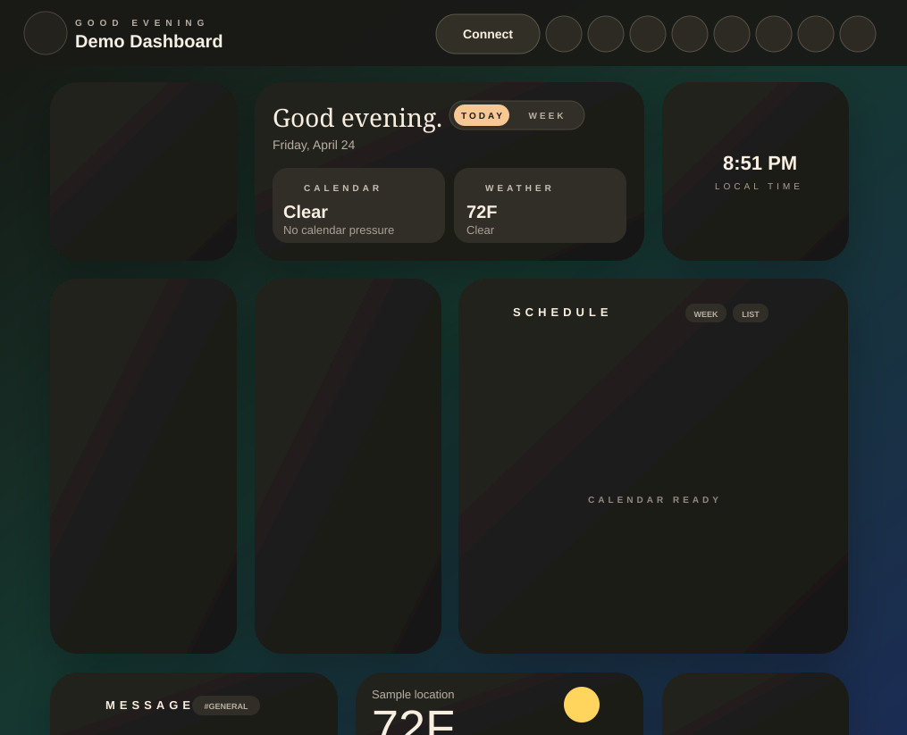

# Curio Robot

Curio Robot is a voice-first AI assistant and live dashboard for browsers, tablets, desktops, Raspberry Pi kiosks, and Home Assistant. It combines real-time conversation, local wake word detection, visual response cards, smart home control, proactive notifications, and a customizable dashboard in one React app.



## What Curio Does

Curio can run as a conversational assistant, a wall-mounted dashboard, a desktop companion, or a Home Assistant panel. The app listens through a selected voice backend, gives spoken responses, invokes tools, and presents useful information as cards or persistent widgets.

Core surfaces:

- **Face mode**: animated robot personalities for a conversational assistant experience.
- **Dashboard mode**: a customizable grid or freeform board with live widgets.
- **Response cards**: temporary cards shown by AI tools, routines, and notifications.
- **Settings console**: integrations, voice backends, dashboard controls, notifications, routines, profiles, display, and device options.
- **PWA and kiosk mode**: fullscreen experiences for iPad, iPhone, Android tablets, Raspberry Pi, and Home Assistant panels.
- **Electron desktop app**: native macOS, Windows, and Linux builds with floating face/card windows.

## Highlights

- Real-time AI conversation through **Gemini Live** or **Amazon Nova Sonic**.
- Text LLM mode with direct **Gemini**, **Ollama**, **Amazon Nova**, hosted providers, and custom endpoints.
- Home Assistant Assist pipeline support.
- Wake word detection with bundled ONNX wake word models.
- Offline TTS options: TinyTTS, Piper TTS, Kitten TTS, Pocket TTS, browser voices, remote TTS, and Pocket voice cloning.
- Camera vision, face tracking, face profiles, speaker profiles, and identity-aware dashboard context.
- 60+ dashboard widgets across productivity, communication, context, media, smart home, personal, and system categories, including Zapier-backed mail/calendar/task/note provider options and a configurable AI Chat widget with conversation history, density and bubble text-size controls, copyable rich replies with images, charts, safe HTML/CSS previews, in-widget provider/model switching, app action tool use, voice input, and file/image attachments.
- 40+ AI response cards for weather, calendar, timers, maps, music, finance, smart home, Gmail, Outlook, Slack, flights, and more.
- Proactive notification rules for calendar, reminders, weather, email, Slack, traffic, chores, and air quality.
- Routine automation with voice, schedule, session, Home Assistant state, and music triggers.
- Google Calendar, Google Tasks, Gmail, Google Photos, Outlook Calendar, Outlook Mail, Slack, Obsidian, Places, Routes, YouTube, weather, and iCal calendar support.
- Password-protected offline backup and restore for settings, dashboards, local user assets, and locally stored account credentials.
- Raspberry Pi kiosk image and Home Assistant add-on packaging.

## Quick Start

Requirements:

- Node.js 20+
- npm
- A Gemini API key for Gemini Live, or another configured voice/text backend

```bash
git clone https://github.com/your-org/curio-robot.git
cd curio-robot
npm install
npm run dev
```

Open `http://localhost:8080`.

The Vite dev server is configured for `0.0.0.0:8080`, so phones and tablets on your network can open:

```text
http://<your-computer-lan-ip>:8080
```

Enter keys and connection details from **Settings** inside the app.

## Common Commands

```bash
npm run dev              # Build the worker bundle and start Vite on port 8080
npm start                # Start Vite on the LAN host
npm run build            # Production build into dist/
npm run preview          # Preview the production build
npm run typecheck        # TypeScript type check
npm test                 # Vitest test suite
npm run sync:piper-assets # Restore bundled Piper TTS voices/phonemizer files
npm run electron:dev     # Electron dev window pointed at the Vite server
npm run electron:build   # Build the Electron app for the current platform
```

## Documentation

- [Documentation index](docs/README.md)
- [Feature guide](docs/features.md)
- [Dashboard and widgets](docs/dashboard.md)
- [Integrations and configuration](docs/integrations.md)
- [Voice and AI backends](docs/voice-ai.md)
- [Offline voice models](docs/offline-voice-models.md)
- [Notifications and routines](docs/design-routines-notifications-dashboard.md)
- [Deployment guide](docs/deployment.md)
- [GitHub publishing checklist](docs/github-publishing.md)
- [Ollama setup](docs/ollama-setup.md)
- [Home Assistant add-on](ha-addon/README.md)
- [Raspberry Pi kiosk image](rpi-image/README.md)

## Dashboard Widgets

Curio's dashboard supports grid and freeform layouts, drag and resize, board controls, contextual search, light/dark themes, stronger glass surfaces, resettable AI-generated page themes with custom colors, selectable or layered AI-generated full-surface canvas animated backgrounds including fire, snow, rain, lightning, fog, embers, bubbles, and cinematic effects, widget settings, refresh modes, and responsive PWA behavior.

Widget categories:

- **Personal**: Profile, Daily Summary, Activity, Greeting, Habits, Insights.
- **Productivity**: Tasks, Chores, Google Tasks, Calendar, Google Calendar, Outlook Calendar, iCal Calendar, Reminders, Notes, Sticky Note, Table, Obsidian Notes, Timers, Alarms, Countdowns, Pomodoro, Stocks, Portfolio, Freeform.
- **Communication**: AI Chat, Mail, Gmail, Outlook Mail, Messages, Slack Channel.
- **Context**: Weather, Forecast, Clock, Analog Clock, World Clock, Traffic, Map, Air Quality, Astronomy, Date Info.
- **Media**: Now Playing, YouTube, Image Gallery, Quote, Fun Fact, Bookmarks, News with combined RSS world feeds and custom feed settings.
- **Smart Home**: Robot Face with optional floating/wandering overlay, Home Assistant Camera, Light, Sensor, Climate, Cover, Media Player, Select, Button Stack, Calendar, Vacuum, 3D Printer, Energy, Home snapshot.
- **System**: Quick Actions, System Status.

See [Dashboard and widgets](docs/dashboard.md) for the full widget list and behavior.

## Response Cards

The assistant can show temporary cards while talking or when tools run. Built-in cards include weather, timer, media, calculation, reminder, image, YouTube, music, news, fun fact, definition, list, quote, sports score, recipe, translation, finance, stopwatch, calendar, alarm, map, places, air quality, joke, trivia, unit conversion, astronomy, commute, camera, thermostat, sensor reading, home status, Obsidian note, chore, energy, security, flight, Gmail, Outlook Mail, and Slack.

Cards are lazy-loaded so the main app does not bundle every card upfront.

## Voice and AI

Curio supports multiple voice paths:

- **Gemini Live** for low-latency speech conversation and tool calling.
- **Amazon Nova Sonic** with a bundled Electron proxy and web dev proxy support.
- **Offline mode** for browser speech recognition plus local/offline TTS.
- **Home Assistant Voice** for Assist pipeline sessions through Home Assistant.
- **Custom LLM** for direct Gemini text, Ollama, Amazon Nova, OpenAI, Claude, Groq, OpenRouter, Mistral, or custom text endpoints with tool routing. Hosted OpenAI-compatible presets use Curio's same-origin proxy in browser and Electron builds to avoid provider CORS blocks, while local/custom endpoints stay direct. Native-search text providers keep their own search path, including Gemini Google Search, OpenAI search models, and Amazon Nova text grounding.
- **External MCP servers** for additional authenticated or unauthenticated tools across Live, Nova, Text LLM, AI Chat, and MCP-backed dashboard providers. Accounts & Keys includes disabled-by-default presets for Exa search, OlyPort public data, Notion OAuth, and authenticated providers such as Linear, GitHub, Sentry, Stripe, Zapier, Firecrawl, Context7, Jina AI, and Cloudflare Radar. Public HTTPS MCPs can use Curio's same-origin MCP and MCP OAuth proxies when servers block browser preflight. Search MCPs, including the LobeHub Exa Web Search Free preset, are fallback search tools for providers without a native or Curio-provided search path; general MCPs remain available as action/data tools.

Text-to-speech engines:

- Browser speech synthesis
- TinyTTS
- Piper TTS
- Kitten TTS
- Pocket TTS
- Remote OpenAI-compatible TTS
- Pocket TTS voice profiles and local voice cloning

The Piper TTS option includes a bundled offline-only US/UK English voice catalog with low and medium weights that fit GitHub's direct file limit without LFS. The app serves those files locally from `public/models/piper-tts/`.

See [Voice and AI backends](docs/voice-ai.md) and [Offline voice models](docs/offline-voice-models.md).

## Integrations

Curio can connect to:

- Home Assistant over MCP-style REST/WebSocket helpers and HA ingress.
- Google Calendar, Google Tasks, Gmail, Google Photos, Places, Routes, and Gemini.
- Outlook Calendar and Outlook Mail through Microsoft OAuth.
- Slack channel/message APIs.
- Obsidian notes.
- YouTube search/playback.
- Open-Meteo style weather and air quality services through the app's weather service.
- Gemini Text, local Ollama, Amazon Nova, hosted text providers, and custom model endpoints.
- iCal/ICS calendar imports for read-only calendar widgets.

See [Integrations and configuration](docs/integrations.md).

## Notifications and Routines

Curio has a shared notification center used by the dashboard, notification sidebar, AI cards, and settings. Proactive alerts can speak, play subtle sounds, show cards, and remain in the notification center.

Routine automation supports:

- Voice phrase triggers
- Scheduled triggers
- Session start/end triggers
- Home Assistant entity state triggers
- Music start/stop triggers
- Steps that speak, wait, call tools, show cards, or call Home Assistant services

See [Notifications and routines](docs/design-routines-notifications-dashboard.md).

## Platform Targets

### Web and PWA

The web app runs in modern Chromium, Safari, and mobile browsers. It includes PWA manifest/service worker support and has iOS/iPad safe-area handling for home-screen use.

### Electron Desktop

```bash
npm run electron:dev
npm run electron:build
npm run electron:build:win
npm run electron:build:mac
npm run electron:build:linux
```

The packaged app serves `dist/` from a local HTTP server and starts the bundled Nova Sonic proxy when needed.

### Home Assistant Add-on

Curio can run inside Home Assistant with ingress support and direct network access on port `8099`. See [ha-addon/README.md](ha-addon/README.md).

### Raspberry Pi Kiosk

The Raspberry Pi image boots directly into Curio in fullscreen Chromium with nginx, Cage, PipeWire, and update scripts. See [rpi-image/README.md](rpi-image/README.md).

## Project Structure

```text
src/
  components/cards/              Response cards shown by AI tools
  components/curio/              Face mode, dashboard, settings, runtime UI
  components/curio/dashboard/    Dashboard widget components
  components/curio/settings/     Settings modal sections
  contexts/                      React providers for cards and live API state
  hooks/                         Runtime hooks for weather, wake locks, dashboard refresh, etc.
  lib/                           Local model engines and pure utility modules
  services/                      API clients, tool router, cards, routines, notifications, TTS, HA, OAuth
  utils/                         Settings storage, secrets, migrations, PWA helpers
electron/                        Electron main/preload process
public/                          Manifest, service worker, fonts, icons, local models
docs/                            GitHub-facing documentation
ha-addon/                        Home Assistant add-on package
rpi-image/                       Raspberry Pi kiosk image builder
scripts/                         Build helpers and local proxies
```

## Security and Privacy Notes

- API keys and OAuth tokens are stored locally through the app's settings/secret storage helpers. Hosted/custom text provider secrets are encrypted and scoped by provider/model/endpoint selection so switching models does not borrow another model's key.
- Settings > Backup & Restore creates encrypted `.curio-backup` files. Full backups require a password with at least six digits and restore only after the password decrypts a preview summary.
- Camera, microphone, speaker profile, face profile, and voice profile features are opt-in.
- Local TTS and wake word models run in the browser; remote providers only receive data when configured and used.
- OAuth redirect URLs must match the exact host where Curio is opened.
- Public screenshots can reveal dashboard data such as location, calendar state, or messages. Review screenshots before publishing them.

## License

Private project unless you add a public license file.
